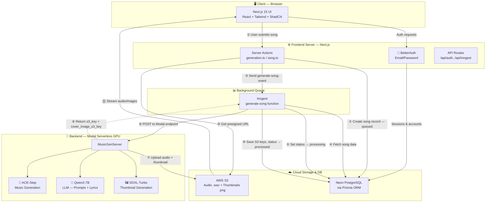
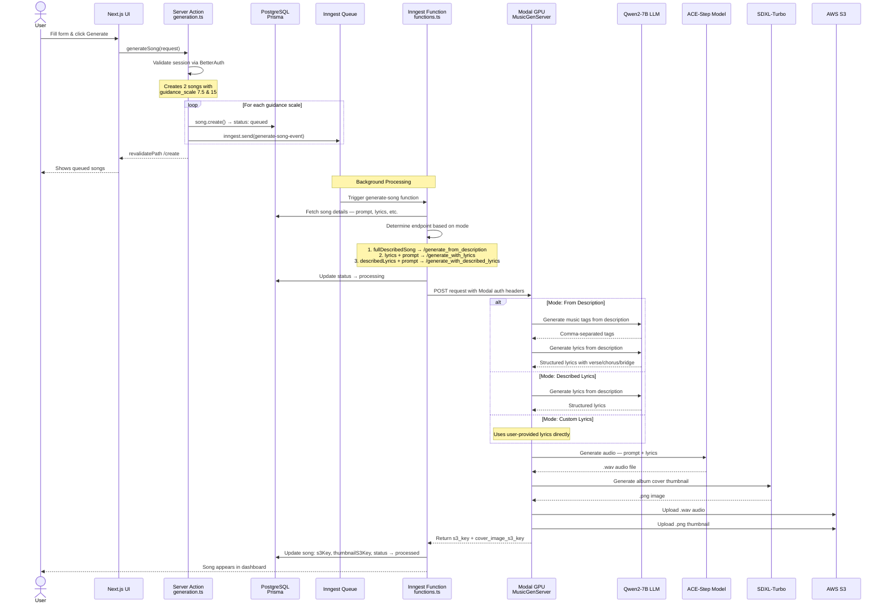
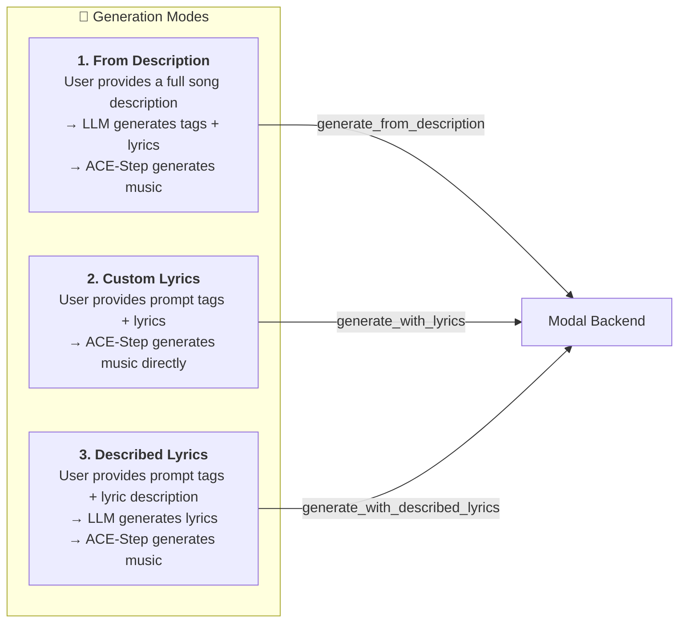
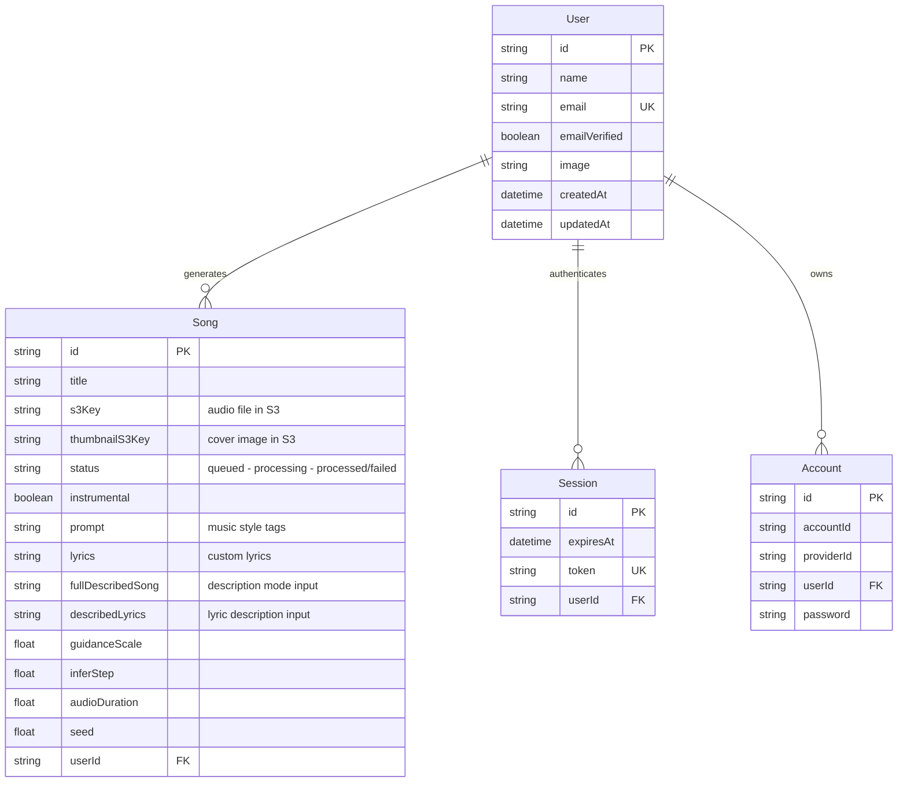

<div align="center">

# 🎵 AI Music Generation Platform

### Full-Stack SaaS that generates complete songs — audio, lyrics, and album art — from a single text prompt

[](https://nextjs.org/)
[](https://react.dev/)
[](https://www.typescriptlang.org/)
[](https://www.python.org/)
[](https://fastapi.tiangolo.com/)
[](https://tailwindcss.com/)
[](https://www.prisma.io/)
[](https://aws.amazon.com/s3/)

[Features](#-features) · [Architecture](#%EF%B8%8F-system-architecture) · [Tech Stack](#-tech-stack) · [Getting Started](#-getting-started) · [Project Structure](#-project-structure) · [License](#-license)

</div>

---

## 🚀 Overview

A production-grade AI music generation platform where users describe the song they want in plain English and the system orchestrates **three AI models** on serverless GPUs to produce a full-length `.wav` audio track (up to 3 minutes), structured lyrics, and AI-generated album cover art — all from a single prompt.

The platform supports multiple generation modes, async background processing with durable task queues, and a persistent global audio player for seamless playback across routes.

---

## ✨ Features

| Feature | Description |
|---|---|
| 🎤 **Multi-Mode Generation** | Three distinct creation modes — describe a song, provide custom lyrics, or describe the lyrics you want — each triggering different AI pipelines |
| 🎹 **Instrumental Toggle** | Bypass lyrics entirely to generate pure instrumental tracks |
| 🧠 **LLM-Powered Prompt Engineering** | Qwen2-7B-Instruct transforms vague user descriptions into structured audio tags and properly formatted song lyrics |
| 🎵 **Full-Length Audio Generation** | ACE-Step generates complete `.wav` audio tracks up to 3 minutes at 140 BPM |
| 🎨 **AI Album Cover Art** | SDXL-Turbo generates relevant cover art thumbnails in just 2 inference steps |
| 🔐 **Authentication** | BetterAuth-powered email/password authentication with session management |

| 📊 **Track Dashboard** | Personal dashboard with search, playback, download, and rename capabilities |
| 🔊 **Global Audio Player** | Zustand-powered persistent audio player that continues playback across route navigation |
| ⚡ **Async Processing** | Inngest durable task queues handle long-running GPU inference without HTTP timeouts |

---

## 🏗️ System Architecture



### Detailed Generation Flow

Step-by-step sequence when a user creates a song:



### Generation Modes



### Data Model



---

## 🛠 Tech Stack

### Frontend
| Technology | Purpose |
|---|---|
| **Next.js 15** (App Router + Turbopack) | React framework with server components and server actions |
| **React 19** | UI library with latest concurrent features |
| **TypeScript** | Type-safe development across the entire frontend |
| **Tailwind CSS v4** | Utility-first styling with the latest v4 engine |
| **Shadcn UI** (Radix Primitives) | Accessible, composable component library |
| **Zustand** | Lightweight global state for the persistent audio player |
| **Zod** + **t3-env** | Runtime environment variable validation |
| **Sonner** | Toast notification system |

### Backend & AI
| Technology | Purpose |
|---|---|
| **Python** + **FastAPI** | High-performance API for ML inference endpoints |
| **Modal** | Serverless GPU compute with custom container images and persistent volumes |
| **ACE-Step** | Music generation model — full-length `.wav` tracks in `bfloat16` precision |
| **Qwen2-7B-Instruct** | LLM for prompt engineering and structured lyric generation |
| **SDXL-Turbo** | Text-to-image model for album cover art in `fp16` (2-step inference) |
| **HuggingFace Transformers** + **Diffusers** | Model loading and inference pipelines |

### Infrastructure
| Technology | Purpose |
|---|---|
| **Inngest** | Durable background task queue with concurrency control and automatic retries |
| **AWS S3** | Cloud storage for generated audio files and cover art |
| **Neon** | Serverless Postgres database |
| **Prisma** | Type-safe ORM for database access and migrations |
| **BetterAuth** | Authentication with email/password and session management |

---

## 🎯 Three Generation Modes

### 1. 📝 Description Mode (Fully Automated)
> *"A melancholic acoustic ballad about leaving home"*

**Pipeline:** User text → **Qwen2-7B** (generates audio tags) → **Qwen2-7B** (generates structured lyrics) → **ACE-Step** (generates audio) → **SDXL-Turbo** (generates cover art)

### 2. ✍️ Custom Lyrics Mode
> Provide your own lyrics + a style prompt like *"indie rock, female vocal, guitar"*

**Pipeline:** User lyrics + prompt → **ACE-Step** (generates audio) → **SDXL-Turbo** (generates cover art)

### 3. 💬 Described Lyrics Mode
> Provide a style prompt + describe the lyrics you want: *"a love song about the ocean"*

**Pipeline:** Lyrics description → **Qwen2-7B** (generates structured lyrics) + style prompt → **ACE-Step** (generates audio) → **SDXL-Turbo** (generates cover art)

> All modes support an **Instrumental** toggle that bypasses lyrics entirely, passing `[instrumental]` to ACE-Step.

---

## 🔧 Getting Started

### Prerequisites

- **Node.js** ≥ 18
- **Python** ≥ 3.10
- **Modal** account (for serverless GPU compute)
- **AWS** account (for S3 storage)
- **Neon** database (or any Postgres instance)
- **Inngest** account (for task queues)

### 1. Clone the Repository

```bash
git clone https://github.com/your-username/ai-music-generation.git
cd ai-music-generation
```

### 2. Backend Setup (Modal)

```bash
cd backend

# Create a virtual environment
python -m venv .venv
source .venv/bin/activate

# Install dependencies
pip install -r requirements.txt

# Configure Modal secrets (set AWS and S3 credentials)
modal secret create music-gen-secrets \
  AWS_ACCESS_KEY_ID=<your-key> \
  AWS_SECRET_ACCESS_KEY=<your-secret> \
  AWS_REGION=<your-region> \
  S3_BUCKET_NAME=<your-bucket>

# Deploy to Modal
modal deploy main.py
```

### 3. Frontend Setup

```bash
cd frontend

# Install dependencies
npm install

# Set up environment variables
cp .env.example .env
# Fill in all values in .env (see Environment Variables below)

# Push database schema
npx prisma db push

# Start the dev server
npm run dev
```

### Environment Variables

Create a `frontend/.env` file with the following values:

```env
# Database
DATABASE_URL=""                          # Neon Postgres connection string

# Auth
BETTER_AUTH_SECRET=""                     # Random secret for session signing

# Modal GPU Endpoints
MODAL_KEY=""                             # Modal proxy auth key
MODAL_SECRET=""                          # Modal proxy auth secret
GENERATE_FROM_DESCRIPTION=""             # Modal endpoint URL for description mode
GENERATE_FROM_DESCRIBED_LYRICS=""        # Modal endpoint URL for described lyrics mode
GENERATE_WITH_LYRICS=""                  # Modal endpoint URL for custom lyrics mode

# AWS S3
AWS_ACCESS_KEY_ID=""                     # IAM access key
AWS_SECRET_ACCESS_KEY_ID=""              # IAM secret key
AWS_REGION=""                            # S3 bucket region
S3_BUCKET_NAME=""                        # S3 bucket name

```

---

## 📁 Project Structure

```
ai-music-generation/
├── backend/
│   ├── main.py                    # Modal app — FastAPI endpoints + 3 AI models
│   ├── prompts.py                 # LLM system prompts for tags & lyrics
│   ├── requirements.txt           # Python dependencies
│   └── ACE-Step/                  # Cloned music generation model repo
│
├── frontend/
│   ├── prisma/
│   │   └── schema.prisma          # Database schema (User, Song, Session, Account)
│   ├── src/
│   │   ├── app/
│   │   │   ├── (auth)/            # Auth pages (sign-in, sign-up)
│   │   │   ├── (main)/
│   │   │   │   ├── page.tsx       # Home / Dashboard
│   │   │   │   └── create/        # Song creation page
│   │   │   └── api/
│   │   │       ├── auth/          # BetterAuth API routes
│   │   │       └── inngest/       # Inngest webhook handler
│   │   ├── actions/
│   │   │   ├── generation.ts      # Server actions: queue song, get presigned URLs
│   │   │   └── song.ts            # Song CRUD operations
│   │   ├── components/
│   │   │   ├── create/            # Track list, song panel, rename dialog
│   │   │   ├── sidebar/           # App sidebar navigation
│   │   │   ├── sound-bar.tsx      # Global persistent audio player
│   │   │   └── ui/               # Shadcn UI primitives
│   │   ├── inngest/
│   │   │   ├── client.ts          # Inngest client instance
│   │   │   └── functions.ts       # Durable generation function with retries
│   │   ├── stores/
│   │   │   └── use-player-store.ts # Zustand audio player state
│   │   ├── lib/                   # Auth config, utilities
│   │   ├── server/                # Database client (Prisma)
│   │   └── env.js                 # t3-env runtime validation
│   ├── package.json
│   └── tsconfig.json
│
└── README.md
```

---

## 🧩 Key Technical Highlights

<details>
<summary><b>🔥 Serverless GPU Infrastructure with Model Caching</b></summary>

Models are loaded once at container startup via `@modal.enter()` and served across requests. Model weights are persisted in `modal.Volume` mounts (`ace-step-models`, `qwen-hf-cache`), eliminating multi-GB downloads on cold starts. The custom container image pre-installs all ML dependencies to minimize startup latency.

```python
@app.cls(
    image=image,
    volumes={"/models": model_volume, "/.cache/huggingface": hf_volume},
    secrets=[music_gen_secrets],
    scaledown_window=15
)
class MusicGenServer:
    @modal.enter()
    def load_model(self):
        self.music_model = ACEStepPipeline(checkpoint_dir="/models", dtype="bfloat16")
        self.llm_model = AutoModelForCausalLM.from_pretrained("Qwen/Qwen2-7B-Instruct")
        self.image_pipe = AutoPipelineForText2Image.from_pretrained("stabilityai/sdxl-turbo")
```
</details>

<details>
<summary><b>⚡ Durable Async Task Processing</b></summary>

Music generation takes 30-60+ seconds on a GPU. Instead of blocking HTTP requests, the system uses Inngest durable functions with per-user concurrency control, automatic retries, and failure handlers that update the database on errors.

```typescript
export const generateSong = inngest.createFunction(
  {
    id: "generate-song",
    concurrency: { limit: 1, key: "event.data.userId" },
    onFailure: async ({ event }) => {
      await db.song.update({ where: { id: songId }, data: { status: "failed" } });
    },
  },
  { event: "generate-song-event" },
  async ({ event, step }) => {
    // prepare-request → set-status-processing → fetch GPU → update-song-result
  }
);
```
</details>

<details>
<summary><b>🔒 Secure Cloud Storage with Presigned URLs</b></summary>

Generated audio and thumbnails are uploaded to S3 from the GPU backend via `boto3`. The frontend generates time-limited presigned URLs (1-hour expiry) for secure, temporary access — files are never publicly accessible.

```typescript
export async function getPresignedUrl(key: string) {
  const command = new GetObjectCommand({ Bucket: env.S3_BUCKET_NAME, Key: key });
  return await getSignedUrl(s3Client, command, { expiresIn: 3600 });
}
```
</details>

<details>
<summary><b>🎯 LLM-Powered Two-Stage Preprocessing</b></summary>

User descriptions are processed through two distinct LLM pipelines:
1. **Prompt Engineering** — Transforms free-text into comma-separated audio tags (genre, vocal type, instruments, mood, tempo, key)
2. **Lyric Generation** — Produces structured lyrics with `[verse]`, `[chorus]`, `[bridge]` tags in the exact format ACE-Step requires

This two-stage preprocessing significantly improves output quality over raw user prompts.
</details>

---

## 📄 License

This project is licensed under the MIT License — see the [LICENSE.MD](LICENSE.MD) file for details.

---

<div align="center">

**Built with ❤️ by [Manish](https://github.com/manish-01882)**

*If you found this project interesting, consider giving it a ⭐!*

</div>
